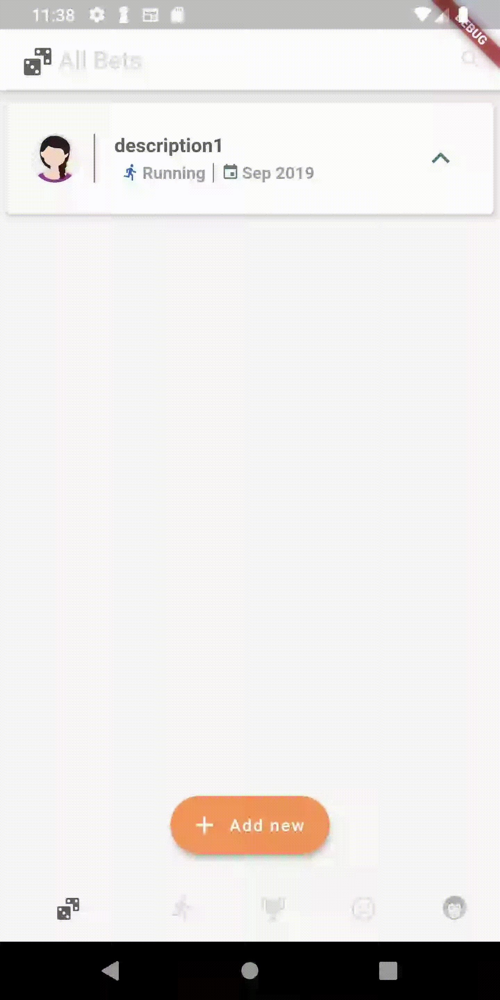
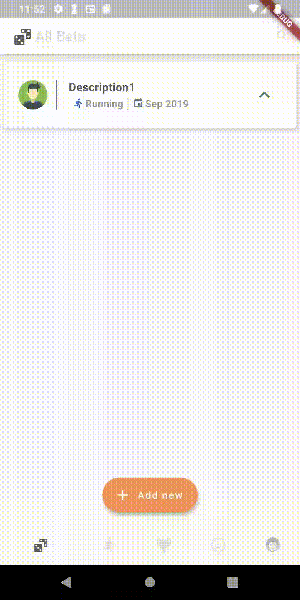

# Bet Collector

**Bet Collector** is a mobile app for saving long term bets between friends

## What this is
- The front end of the appliction in the shape of a mobile app built using [flutter](https://flutter.dev/)

- The app mainly uses [flutter's own material design widgets](https://flutter.dev/docs/development/ui/widgets/material)

- it's using some Go services for communicating with the database
- These services are:
  - User service (not yet implemented)
  - Bet Service (not yet implemented)
  - Friends service (not yet implemented)

## How to run
- Launch all the backend services mentioned in the previous section by Following the corresponding `README.md` file for each service.
- Make sure that flutter is installed and that `flutter doctor` runs without any errors.
- Launch an emulator or connect a device to your pc / laptop
- Run `flutter run`

## Screenshots

Viewing different bet states | View Profile
--- | ---
 | 

Create a new Bet | Viewing Bet Details
--- | ---
 | 

Delete Bet | Change Bet state
--- | ---
 | 

## Contributions
- For style related values please add the new value to the corresponding file inside [Styles folder](./lib/styles)
- [Provider package](https://pub.dev/packages/provider) is used for sharing data between widgets. Please take a look before any contribution
- Always keep your widgets small
- Don't be afraid to use inheritence when needed but also keep in mind that the best practice is to re use widgets instead of extending a widget:
  - [BetActions.dart](./lib/widgets/BetCard/BetActions.dart) (abstract class)
  - [BetSlidable.dart](./lib/widgets/BetCard/BetSlidable.dart)
  - [BetActionButtons.dart](./lib/widgets/BetCard/BetActionButtons.dart)

###### **NOTE:** Please check the [contributing.md](./contributing.md) file before creating any pull request. 🤗
